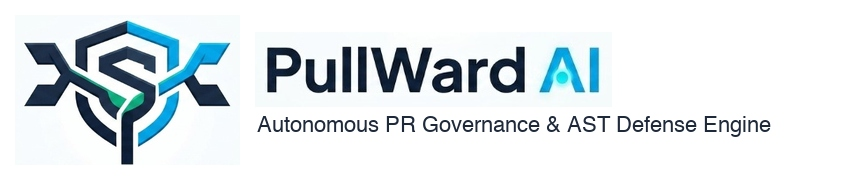

<div align="center">

  

  # 🔰 PullWard AI
  ### Autonomous PR Governance & AST Defense Engine

  [](https://python.org)
  [](https://github.com/google/adk)
  [](https://ai.google.dev)
  [](https://cloud.google.com/run)
  [](https://cloud.google.com/bigquery)

</div>

---

## 📌 Executive Summary

**PullWard AI** is an autonomous, multi-agent code governance and security gatekeeper. Built on **Google Cloud Platform**, **Google Gemini 3.6 Flash**, and the **Google Agent Development Kit (ADK)**, PullWard AI intercepts GitHub Pull Requests in real time, executes specialized domain-agent reviews, streams compliance metrics to **Google Cloud BigQuery**, and posts automated governance reports back to GitHub before code reaches production.

---

## 📐 Architecture Overview

PullWard AI uses **Google ADK (`google.adk.Agent`)** to orchestrate specialized domain sub-agents under a supervisor agent:

```
                        ┌───────────────────────────────┐
                        │    GitHub PR Webhook Event    │
                        └──────────────┬────────────────┘
                                       │
                                       ▼
                        ┌───────────────────────────────┐
                        │   FastAPI Governance Gateway  │
                        │        (src/main.py)          │
                        └──────────────┬────────────────┘
                                       │
                                       ▼
                        ┌───────────────────────────────┐
                        │ Google ADK Supervisor Agent   │
                        │    (agents/orchestrator.py)   │
                        └───────┬───────┬───────┬───────┘
                                │       │       │
       ┌───────────────────────┘       │       └────────────────────────┐
       ▼                               ▼                                ▼
┌─────────────────────────┐  ┌───────────────────┐  ┌─────────────────────────────┐
│  AST Governance Agent   │  │  Security Agent   │  │    Schema Safety Agent      │
│  - Python AST Visitor   │  │  - Secret Scanner │  │  - Destructive SQL drops    │
│  - Signature Fallbacks  │  │  - Dangerous eval │  │  - Schema breaking changes  │
└────────────┬────────────┘  └─────────┬─────────┘  └──────────────┬──────────────┘
             │                         │                           │
             └─────────────────────────┼───────────────────────────┘
                                       │
                                       ▼
                   ┌────────────────────────────────────────┐
                   │ Consolidated Verdict:                  │
                   │ APPROVED / NEEDS_REVIEW / BLOCKED      │
                   └───────────────────┬────────────────────┘
                                       │
               ┌───────────────────────┴───────────────────────┐
               ▼                                               ▼
┌─────────────────────────────┐                 ┌─────────────────────────────┐
│ Stream Audit Event to GCP   │                 │ Post Governance Report to   │
│ BigQuery (logger.py)        │                 │ GitHub PR Comments          │
└─────────────────────────────┘                 └─────────────────────────────┘
```

---

## 🤖 Multi-Agent Architecture (Google ADK Framework)

1. **PullWard Orchestrator** ([`src/agents/orchestrator.py`](file:///Users/srabantichakraborty/Desktop/Google%20Cloud%20Patchamomma%202026/PullWard-AI/src/agents/orchestrator.py)): Built with **Google ADK (`google.adk.Agent`)**. Coordinates specialized sub-agents, aggregates domain findings, determines the final verdict (`APPROVED`, `NEEDS_REVIEW`, `BLOCKED`), and generates formatted markdown reports.
2. **AST Governance Agent** ([`src/agents/ast_agent.py`](file:///Users/srabantichakraborty/Desktop/Google%20Cloud%20Patchamomma%202026/PullWard-AI/src/agents/ast_agent.py)): Performs polyglot static AST parsing across Python, TypeScript, JavaScript, C#, Java, and Go to detect removed functions, reduced parameter lists, or deleted classes.
3. **Security Audit Agent** ([`src/agents/security_agent.py`](file:///Users/srabantichakraborty/Desktop/Google%20Cloud%20Patchamomma%202026/PullWard-AI/src/agents/security_agent.py)): Scans code diffs for exposed secrets (Google API keys, GitHub tokens, RSA private keys) and dangerous execution calls (`eval()`, `exec()`, raw SQL string concatenation).
4. **Schema Safety Agent** ([`src/agents/schema_agent.py`](file:///Users/srabantichakraborty/Desktop/Google%20Cloud%20Patchamomma%202026/PullWard-AI/src/agents/schema_agent.py)): Inspects SQL scripts and migration files to detect destructive statements (`DROP TABLE`, `DROP COLUMN`, `DROP DATABASE`).

---

## ⚙️ Environment Configuration

Copy `.env.example` to `.env` and fill in your API keys:

```bash
cp .env.example .env
```

| Variable | Description | Default |
| :--- | :--- | :--- |
| `GEMINI_API_KEY` | Google Gemini API key from AI Studio or Vertex AI | Required |
| `GEMINI_MODEL` | Gemini model selection | `gemini-3.6-flash` |
| `GCP_PROJECT_ID` | Google Cloud Platform project ID | `pullward-ai` |
| `BIGQUERY_DATASET` | BigQuery audit logs dataset name | `pullward_audit` |
| `GITHUB_WEBHOOK_SECRET` | HMAC SHA-256 secret key for webhook verification | Optional |
| `GITHUB_TOKEN` | Personal Access Token to post comments back to PR | Optional |
| `PORT` | Webhook HTTP port | `8080` |

---

## 🚀 Quickstart & Local Development

### 1. Install Dependencies
```bash
python3 -m venv venv
source venv/bin/activate
pip install -r requirements.txt
```

### 2. Launch Local Gateway Server
```bash
python main.py
```
The server will start at `http://localhost:8080`.

---

## 📊 GCP BigQuery Audit Setup

To initialize the BigQuery dataset (`pullward_audit`) and audit table (`pr_audit_logs`), run:
```bash
python src/schemas.py
```

---

## ☁️ Google Cloud Run Serverless Deployment

Deploy containerized service on **Google Cloud Run**:

```bash
# Build & tag Docker image
docker build -t gcr.io/$GCP_PROJECT_ID/pullward-ai:latest .

# Push to Container Registry
docker push gcr.io/$GCP_PROJECT_ID/pullward-ai:latest

# Deploy to Cloud Run
gcloud run deploy pullward-ai \
  --image gcr.io/$GCP_PROJECT_ID/pullward-ai:latest \
  --platform managed \
  --region us-central1 \
  --allow-unauthenticated \
  --set-env-vars GEMINI_API_KEY=$GEMINI_API_KEY,GCP_PROJECT_ID=$GCP_PROJECT_ID,GITHUB_TOKEN=$GITHUB_TOKEN
```

---

## 📄 License

Distributed under the Apache 2.0 License. See `LICENSE` for details.
